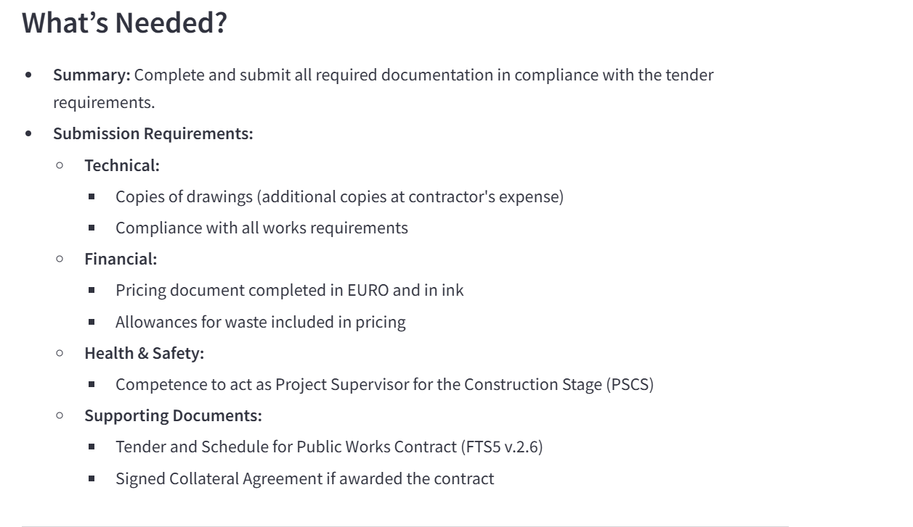

## PDF-Summarizer
End-to-end app using Open AI. Please add your OPENAI_API_KEY in openai.env.

Running the App
To run the app locally, use the following command:
```
streamlit run app.py
```
### Architecture


### APP


#### Summary Example





